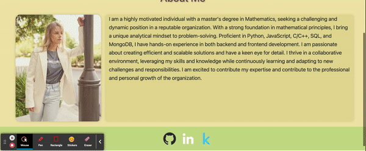

# React Portfolio
15th Assignment of UCB Extension Web Development Bootcamp

Please see the [deployed website](https://liubovsobolevskaya.github.io/react-portfolio)

## Description

When you open the portfolio, you see a page with a header, a content section, and a footer. The header displays the developer's name and a navigation menu with different sections of the portfolio. The navigation menu includes titles like "About Me," "Portfolio," "Contact," and "Resume," with the currently selected section highlighted.

If you click on any of the navigation titles, the corresponding section appears below the navigation without the page reloading, and the selected title is highlighted. When you first open the portfolio, the default selected section is "About Me." In the "About Me" section, you will find a recent photo or avatar of the developer along with a short biography.

In the "Portfolio" section, you will see titled images of six applications developed by the developer. These images link to both the deployed applications and the corresponding GitHub repositories. In the "Contact" section, there is a form with fields for name, email address, and a message. If you move your cursor out of any of the form fields without entering any text, you will receive a notification that the field is required. If you enter text in the email address field, you will be notified if the email address is invalid.

The "Resume" section contains a link to download the developer's resume and a list of their skills and proficiencies. Lastly, in the footer of the page, you will find text or icon links to the developer's profiles on GitHub, LinkedIn, and Kaggle.

---
## Appearance and Functionality

## Technology Used

- [Git](https://git-scm.com/)
- [JavaScript](https://www.javascript.com/)
- [Node.js](https://nodejs.dev/)
- [React](https://react.dev/)

## Author Info

### Liubov Sobolevskaya

- [LinkedIn](https://www.linkedin.com/in/liubov-sobolevskaya/)
- [Github](https://github.com/LiubovSobolevskaya)
- [Kaggle](https://www.kaggle.com/lyubovsobolevskaya)

I would like to express my gratitude to James Harding for helping me to make my resume downloadable.
